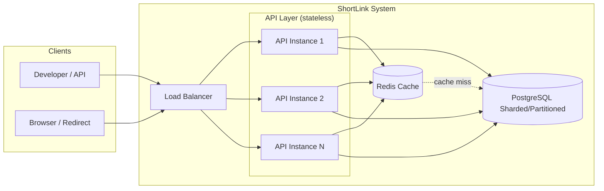
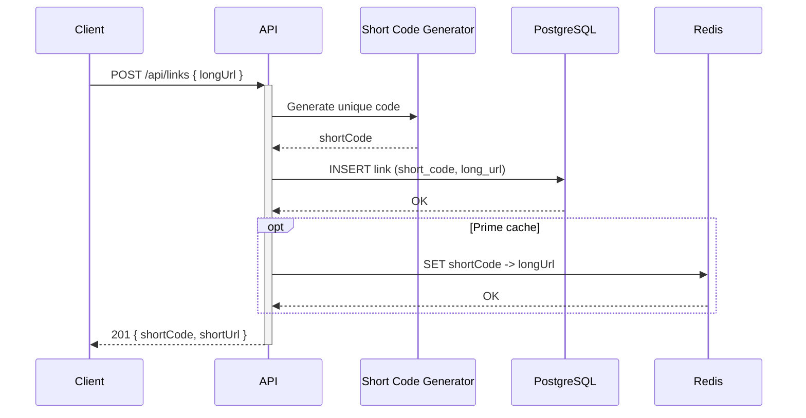
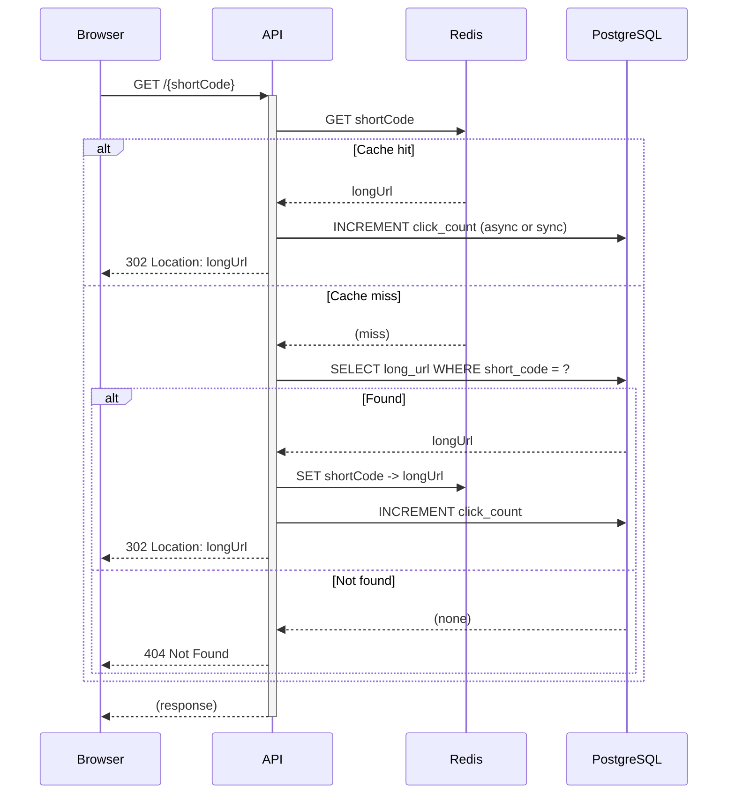
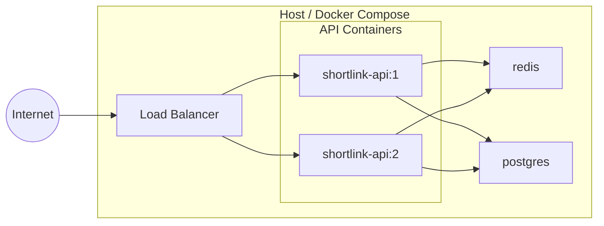

# Architecture Decision Document

**Product:** ShortLink — High Scale URL Shortener  
**Project:** URL-Shoter  

This document captures technical decisions to keep implementation consistent across AI agents and developers. It is derived from the Product Brief and PRD.

---

## Architecture Diagrams

### 1. High-Level System Architecture

Clients hit a load balancer; stateless API instances resolve requests using Redis (redirect path) and a sharded/partitioned PostgreSQL backend (persistence, sharded by short_code). API instances scale horizontally.



### 2. Create Short URL Flow

Client sends long URL; API generates short code, persists to PostgreSQL, optionally primes cache, and returns short URL.



### 3. Redirect Flow (Cache-Aside)

Redirect request: check Redis first; on miss load from PostgreSQL and populate cache, then respond with 302 and increment click count.



### 4. Component / Layer Diagram

Logical layers within the API: HTTP endpoints delegate to features, which use domain and infrastructure.

```mermaid
flowchart TB
    subgraph External["External"]
        HTTP[HTTP Clients]
    end

    subgraph API["ShortLink.Api"]
        subgraph Endpoints["Endpoints / Controllers"]
            POST[POST /api/links]
            GET_R[GET /{shortCode}]
            GET_M[GET /api/links/{shortCode}]
        end
        subgraph Features["Features"]
            Create[CreateLink]
            Redirect[Redirect]
            Metadata[GetLinkMetadata]
        end
        subgraph Domain["Domain"]
            Link[Link]
            IGen[IShortCodeGenerator]
        end
        subgraph Infrastructure["Infrastructure"]
            Repo[LinkRepository]
            Cache[RedisLinkCache]
            Gen[ShortCodeGenerator]
        end
    end

    subgraph Data["Data Stores"]
        Redis[(Redis)]
        PG[(PostgreSQL)]
    end

    HTTP --> POST
    HTTP --> GET_R
    HTTP --> GET_M
    POST --> Create
    GET_R --> Redirect
    GET_M --> Metadata
    Create --> Link
    Create --> IGen
    Create --> Repo
    Redirect --> Cache
    Redirect --> Repo
    Metadata --> Repo
    IGen --> Gen
    Repo --> PG
    Cache --> Redis
    Gen --> Repo
```

### 5. Deployment (Docker)

Runtime topology: all services can run in Docker; load balancer in front of API for production.



---

## Project Context Analysis

### Requirements Overview

**Functional Requirements (architectural implications):**

- **URL Shortening (FR1–FR3):** API must accept long URL, generate unique short code, persist mapping in durable store. Drives: API design, short-code algorithm, database schema, write path.
- **Redirection (FR4–FR6):** Resolve short code → HTTP redirect; P95 < 100ms; 404 for unknown. Drives: read path, cache layer, redirect semantics (302/301).
- **Click Tracking (FR7–FR8):** Increment count on redirect; expose count (and long URL) via API. Drives: write-on-redirect, storage schema, optional metadata endpoint.
- **API & Integration (FR9–FR10):** Documented API; no auth in MVP. Drives: REST contract, OpenAPI, error formats.
- **Operations & Scalability (FR11–FR14):** Stateless app servers, Redis cache, sharded/partitioned PostgreSQL backend, Docker, load-balanced API. Drives: deployment model, caching strategy, and DB sharding/partitioning strategy by short_code to support 10M+ redirects/day.

**Non-Functional Requirements:**

- **Performance:** P95 redirect < 100ms; create API responsive; cache hit rate > 80%.
- **Scalability:** 10M+ redirects/day; horizontal scaling of API and cache.
- **Reliability:** 99.9% uptime; 5-year URL retention.
- **Operational:** Docker deploy; observability (metrics, health, logs).

**Scale & Complexity:**

- **Primary domain:** API/backend service.
- **Complexity level:** Low–medium (high throughput, simple domain model).
- **Architectural components:** API layer, cache layer, persistence layer, short-code generator, redirect handler, optional metadata API.

### Technical Constraints & Dependencies

- **Stack (from PRD):** .NET 8 Web API, PostgreSQL, Redis, Docker, k6 for load testing.
- **Dependencies:** PostgreSQL and Redis must be available at runtime; API is stateless and depends only on cache + DB.
- **No auth in MVP:** No identity provider or session store required.

### Cross-Cutting Concerns

- **Latency:** Redirect path must be cache-first; create path is DB write + optional cache prime.
- **Consistency:** Click count increment vs. redirect visibility (eventual consistency acceptable for counts).
- **Idempotency:** Create endpoint policy (e.g. same long URL → same short code or new code) to be fixed in implementation.
- **Observability:** Logging, metrics, and health checks across API and dependencies.

---

## Starter Template Evaluation

### Primary Technology Domain

**API/Backend** — .NET 8 Web API. No frontend starter; backend-only service.

### Starter Options Considered

- **.NET 8 Web API (minimal/standard template):** Default ASP.NET Core Web API template provides minimal hosting, middleware pipeline, and OpenAPI support. Chosen as the base; no third-party “starter” required.
- **Alternatives (not chosen):** Custom boilerplates add opinionated structure; for this project the standard template plus clear layering is sufficient.

### Selected Approach: .NET 8 Web API Template

**Rationale:** PRD and product brief mandate .NET 8 Web API. The built-in project template gives a runnable API with Swagger/OpenAPI and dependency injection. Project structure and patterns are defined in this document rather than by an external starter.

**Initialization (when creating from scratch):**

```bash
dotnet new webapi -n ShortLink.Api -o src/ShortLink.Api --no-https
```

**Architectural decisions provided by this choice:**

- **Language & runtime:** C# 12, .NET 8.
- **API style:** REST; controllers or minimal APIs as chosen in Core Decisions.
- **Build:** `dotnet build`; no extra front-end tooling.
- **Testing:** xUnit (or NUnit) for unit/integration tests; k6 for load tests (separate repo or folder).
- **Code organization:** Follow Project Structure section below.

---

## Core Architectural Decisions

### Decision Priority Analysis

**Critical (block implementation):**

- Data store: PostgreSQL for links and click counts.
- Cache: Redis for short-code → long-URL lookups on redirect path.
- Short-code generation: Collision-free algorithm (e.g. base62 + DB/counter or random with collision check).
- Redirect semantics: HTTP 302 (or 301) with Location header.

**Important (shape architecture):**

- API style: Minimal APIs vs controllers (recommend minimal or single controller for three operations).
- Response/error format: JSON; consistent error schema.
- Cache key format and TTL.
- Health checks: Liveness and readiness (DB + Redis).

**Deferred (post-MVP):**

- Authentication/authorization.
- Custom domains.
- Rate limiting implementation details (design only in MVP if needed).

### Data Architecture

| Decision | Choice | Rationale |
|----------|--------|------------|
| **Primary store** | PostgreSQL (sharded/partitioned) | Durable, supports 5-year retention; horizontally scalable via hash or range partitioning/sharding by short_code. |
| **Schema** | Tables: `links` (short_code, long_url, created_at), `clicks` or count column on `links` | One row per short link; click count either column or separate table for high write volume. |
| **Migrations** | EF Core migrations or SQL scripts | Versioned schema changes; repeatable deployments. |
| **Caching** | Redis | In-memory lookup for redirect path; key = short_code, value = long_url; TTL optional (e.g. 7–30 days) or no TTL with explicit invalidation. |
| **Cache strategy** | Cache-aside on redirect: read Redis → on miss read DB, then populate Redis | Ensures > 80% hit rate for hot links; cold links pay one DB read. |
| **Create path** | Write to PostgreSQL; optionally set Redis key for immediate redirects | Reduces first-click latency. |

### Authentication & Security

| Decision | Choice | Rationale |
|----------|--------|------------|
| **Authentication (MVP)** | None | PRD: no auth in MVP. |
| **API security** | HTTPS in production; optional rate limiting (per-IP or per-key) post-MVP | Protect from abuse; rate limits can be added without auth. |
| **Input validation** | Validate URL format and length on create; reject malicious or invalid URLs | Prevent abuse and bad data. |
| **Data at rest/transit** | TLS in transit; DB and Redis best practices (access control, encryption as per host) | Standard operational security. |

### API & Communication Patterns

| Decision | Choice | Rationale |
|----------|--------|------------|
| **API style** | REST over HTTP/JSON | PRD and product brief; simple for clients. |
| **Endpoints** | POST /api/links (create), GET /{shortCode} (redirect), GET /api/links/{shortCode} (metadata optional) | Create and resolve are primary; metadata supports click-count use case. |
| **Redirect** | 302 Found (or 301 if permanent) with Location: longUrl | 302 allows analytics; 301 if business prefers permanent. |
| **Documentation** | OpenAPI (Swagger) | PRD requires machine- and human-readable API docs. |
| **Error format** | JSON: `{ "error": { "code": "...", "message": "..." } }` with HTTP status | Consistent for clients. |
| **Idempotency (create)** | Define in implementation: e.g. same long URL returns same short code (idempotent) or new code each time | Document in API spec once chosen. |

### Infrastructure & Deployment

| Decision | Choice | Rationale |
|----------|--------|------------|
| **Hosting** | Stateless API instances behind a load balancer | PRD: horizontal scaling. |
| **Containers** | Docker for API; PostgreSQL and Redis as containers or managed services | PRD: Docker-based deployment. |
| **Orchestration** | Docker Compose for local/dev; production can use same or Kubernetes/ECS as needed | MVP: Compose sufficient. |
| **Configuration** | Environment variables or appsettings + env override (e.g. connection strings, Redis endpoint) | 12-factor style. |
| **Health checks** | /health/live (process up), /health/ready (DB + Redis reachable) | NFR-O2; supports load balancer and ops. |
| **Observability** | Structured logs; metrics (e.g. redirect count, latency percentiles, cache hit rate) | NFR-O2; validate SLAs. |
| **Load testing** | k6 scripts for redirect and create; target P95 and 10M+/day validation | PRD. |

### Decision Impact Analysis

**Implementation sequence:**

1. Solution and project setup (.NET 8 Web API, Docker Compose for DB + Redis).
2. Domain model and persistence (PostgreSQL schema, repository or EF Core).
3. Short-code generation (algorithm + collision handling).
4. Create endpoint (POST /api/links).
5. Redirect path: Redis cache-aside + GET /{shortCode} → 302 + click increment.
6. Metadata endpoint GET /api/links/{shortCode} (optional).
7. Health checks and observability.
8. k6 load tests and tuning.

**Cross-component dependencies:** API depends on Redis and PostgreSQL; redirect path depends on cache then DB; create path writes DB (and optionally cache). No circular dependencies.

---

## Implementation Patterns & Consistency Rules

### Pattern Categories Defined

**Critical conflict points:** Naming (API, DB, code), response/error format, and project layout so that multiple agents or developers produce consistent code.

### Naming Patterns

**Database:**

- Tables: `snake_case` (e.g. `links`).
- Columns: `snake_case` (e.g. `short_code`, `long_url`, `click_count`, `created_at`).
- Primary key: `id` or natural key `short_code` as appropriate.

**API:**

- Routes: kebab-case or canonical (e.g. `/api/links`, `/{shortCode}`).
- JSON request/response: camelCase (e.g. `longUrl`, `shortCode`, `clickCount`).
- Query/route params: camelCase or short_code as-is.

**Code (C#):**

- Types and methods: PascalCase.
- Parameters and locals: camelCase.
- Private fields: _camelCase or camelCase.
- Files: one main type per file; name file after type (e.g. `LinkEntity.cs`, `ShortLinkService.cs`).

### Structure Patterns

**Project organization:**

- Feature/capability grouping under `Features` or `Modules` (e.g. CreateLink, Redirect, Metadata).
- Shared: `Domain`, `Infrastructure` (repositories, cache), `Contracts` (DTOs, API models).
- Tests: mirror source layout; `*.Tests` project(s) for unit/integration.

**File structure:**

- Controllers or minimal API endpoints in one place; handlers/services in feature folders.
- Configuration in `appsettings.json` and environment; no secrets in repo.

### Format Patterns

**API:**

- Success: 200/201 with JSON body (e.g. `{ "shortCode": "...", "shortUrl": "..." }`).
- Errors: HTTP status 4xx/5xx with body `{ "error": { "code": "NotFound", "message": "..." } }`.
- Dates: ISO 8601 in JSON.

**Data exchange:**

- Request/response: camelCase JSON.
- DB: snake_case; map in persistence layer.

### Process Patterns

**Error handling:**

- Global exception filter or middleware: map exceptions to HTTP status and error body; log server-side.
- Validation: use DataAnnotations or FluentValidation; return 400 with clear message.

**Redirect path:**

- Lookup cache → on miss lookup DB → if found write cache and redirect; if not found 404.
- Increment click count after redirect decision (async or sync as chosen; eventual consistency acceptable).

### Enforcement Guidelines

**All implementers MUST:**

- Use the same API route and JSON conventions as in this document and the PRD.
- Follow the chosen DB and cache naming (snake_case DB, camelCase API).
- Implement health checks and observability as specified.

**Pattern verification:** Code review and OpenAPI spec as source of truth; run k6 to validate latency and throughput.

---

## Project Structure & Boundaries

### Complete Project Directory Structure

```
URL-Shoter/
├── README.md
├── .gitignore
├── docker-compose.yml
├── Directory.Build.props
├── ShortLink.sln
├── src/
│   ├── ShortLink.Domain/
│   │   ├── ShortLink.Domain.csproj
│   │   └── Domain/
│   │       ├── Link.cs
│   │       ├── IShortCodeGenerator.cs
│   │       ├── ILinkRepository.cs
│   │       ├── ILinkCache.cs
│   │       └── ILinkResolver.cs
│   ├── ShortLink.Infrastructure/
│   │   ├── ShortLink.Infrastructure.csproj
│   │   └── Infrastructure/
│   │       ├── Persistence/
│   │       │   ├── LinkRepository.cs
│   │       │   ├── LinkEntity.cs
│   │       │   └── AppDbContext.cs
│   │       ├── Cache/
│   │       │   └── RedisLinkCache.cs
│   │       └── ShortCodeGenerator.cs
│   └── ShortLink.Api/
│       ├── ShortLink.Api.csproj
│       ├── Program.cs
│       ├── appsettings.json
│       ├── appsettings.Development.json
│       ├── Dockerfile
│       ├── Controllers/                    # if using controllers
│       │   └── LinksController.cs
│       ├── Endpoints/                     # if using minimal APIs
│       │   └── LinkEndpoints.cs
│       ├── Features/
│       │   ├── CreateLink/
│       │   │   ├── CreateLinkHandler.cs
│       │   │   ├── CreateLinkRequest.cs
│       │   │   └── CreateLinkResponse.cs
│       │   ├── Redirect/
│       │   │   ├── RedirectHandler.cs
│       │   │   └── RedirectResult.cs
│       │   └── GetLinkMetadata/
│       │       ├── GetLinkMetadataHandler.cs
│       │       └── LinkMetadataResponse.cs
│       ├── Middleware/
│       │   └── ExceptionHandlingMiddleware.cs
│       └── Configuration/
│           ├── RedisOptions.cs
│           └── HealthCheckConfiguration.cs
├── tests/
│   ├── ShortLink.Api.UnitTests/
│   │   └── ShortLink.Api.UnitTests.csproj
│   └── ShortLink.Api.IntegrationTests/
│       └── ShortLink.Api.IntegrationTests.csproj
├── load/
│   └── k6/
│       ├── redirect.js
│       └── create.js
└── _bmad-output/
    └── planning-artifacts/
        ├── prd.md
        ├── product-brief-URL-Shoter-2026-03-11.md
        └── architecture.md
```

### Architectural Boundaries

**API boundaries:**

- **External:** POST /api/links, GET /{shortCode}, GET /api/links/{shortCode}. No auth in MVP.
- **Internal:** ShortLink.Api uses ShortLink.Domain abstractions and ShortLink.Infrastructure implementations (repository, cache, short-code generator) via DI.

**Component and project boundaries:**

- **API layer (`ShortLink.Api`):** HTTP handling, validation, mapping to/from DTOs; references Domain and Infrastructure.
- **Domain layer (`ShortLink.Domain`):** Link entity and contracts (`IShortCodeGenerator`, `ILinkRepository`, `ILinkCache`, `ILinkResolver`); no dependencies on Infrastructure.
- **Infrastructure layer (`ShortLink.Infrastructure`):** PostgreSQL (repository, `AppDbContext`), Redis (cache), concrete short-code generator; references Domain but not Api.

**Data boundaries:**

- **DB:** Sharded/partitioned PostgreSQL; tables for links and optionally click counts; sharding/partitioning uses short_code as the key to spread load and support 10M+ redirects/day.
- **Cache:** Redis; key = short_code (or prefix), value = long_url; optional TTL.
- **No shared state between API instances:** Stateless; all state in DB or Redis.

### Requirements to Structure Mapping

| Requirement area | Location |
|------------------|----------|
| Create short URL (FR1–FR3) | Features/CreateLink, Infrastructure (repository, short-code), Domain |
| Redirect (FR4–FR6) | Features/Redirect, Infrastructure (cache, repository) |
| Click tracking (FR7–FR8) | Features/Redirect (increment), GetLinkMetadata (read), Infrastructure |
| API contract (FR9–FR10) | Endpoints or Controllers, DTOs in Features |
| Stateless / scaling (FR11–FR14) | No in-memory state; Dockerfile, docker-compose, health checks |

### Integration Points

**Internal:** Handlers → Domain + Infrastructure. Repository and cache interfaces in application layer; implementations in Infrastructure.

**External:** Clients call REST API; API calls PostgreSQL and Redis. No other external services in MVP.

**Data flow:** Create: Client → API → ShortCodeGenerator + Repository (→ DB, optional Redis). Redirect: Client → API → Cache (miss → Repository) → 302 + increment count → DB/cache.

---

## Architecture Validation Results

### Coherence Validation

**Decision compatibility:** Technology choices are consistent: .NET 8, PostgreSQL, Redis, Docker. Cache-aside and stateless design support NFRs. No conflicting decisions.

**Pattern consistency:** Naming (DB snake_case, API camelCase), error format, and project layout are aligned with the stack and PRD.

**Structure alignment:** Directory layout supports feature-based organization, clear separation of API, domain, and infrastructure, and matches FR categories.

### Requirements Coverage Validation

**Functional requirements:** All FR1–FR14 are addressed: create/redirect/metadata endpoints, short-code generation, persistence, cache, stateless deployment, Docker, load balancing.

**Non-functional requirements:** NFR-P1–P3 (latency, cache hit) addressed by Redis cache and cache-aside; NFR-S1–S2 by stateless scaling; NFR-R1–R2 by PostgreSQL and retention; NFR-O1–O2 by Docker and health/observability.

### Implementation Readiness Validation

**Decision completeness:** Stack, data model, API contract, caching, and deployment are documented with enough detail to implement.

**Structure completeness:** Solution, projects, and folders are specified; first implementation can follow this tree.

**Pattern completeness:** Naming, formats, and process patterns are defined to avoid agent/developer divergence.

### Gap Analysis Results

- **Minor:** Rate limiting policy (e.g. per-IP limits) can be defined during implementation; not blocking.
- **Minor:** Idempotency rule for POST /api/links (same long URL → same/different short code) to be fixed in API spec.
- **No critical gaps** for MVP.

### Architecture Completeness Checklist

**Requirements analysis:** Done; project context, scale, constraints, and cross-cutting concerns captured.

**Architectural decisions:** Data, security, API, and infrastructure decisions documented with rationale.

**Implementation patterns:** Naming, structure, format, and process patterns defined.

**Project structure:** Directory tree and boundaries defined; requirements mapped to structure.

### Architecture Readiness Assessment

**Overall status:** READY FOR IMPLEMENTATION.

**Confidence:** High — PRD and product brief are clear; stack and patterns are aligned.

**Strengths:** Simple domain, clear read/write paths, standard stack, stateless and horizontally scalable design.

**Future enhancement:** Auth, custom domains, rate limiting, multi-region; schema and stateless design support these.

### Implementation Handoff

**Guidelines for implementers and AI agents:**

- Follow this document and the PRD for all technical and product requirements.
- Use the same API routes, JSON shapes, and error format as specified.
- Respect the project structure and boundaries above.
- Implement health checks and observability; validate with k6 for latency and throughput.

**First implementation priority:** Create solution and Web API project; add Docker Compose for PostgreSQL and Redis; implement domain model and create endpoint (POST /api/links), then redirect path with cache-aside and click increment.

---

This architecture document is the single source of truth for technical decisions for ShortLink (URL-Shoter). Update it when decisions change so that implementation stays consistent.
